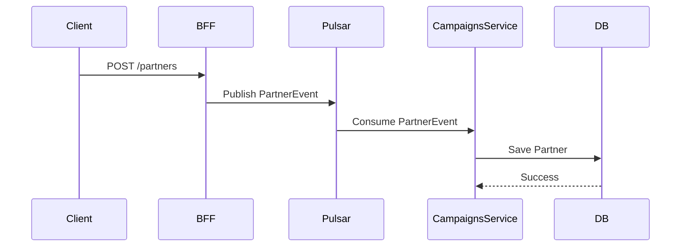
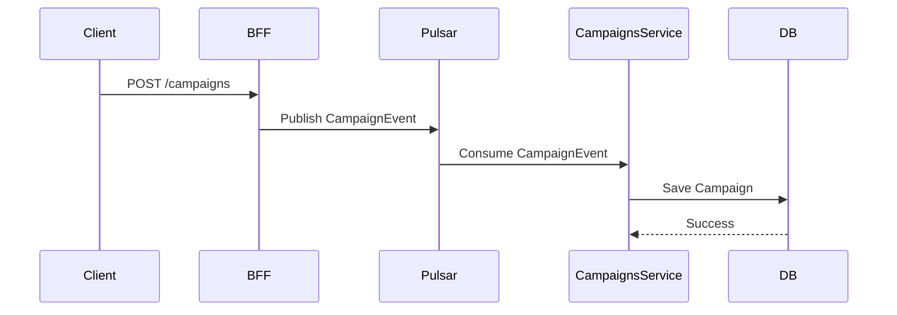
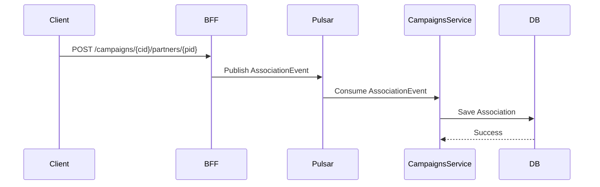
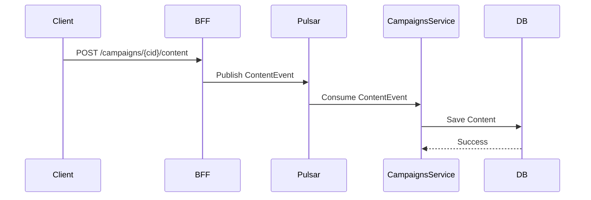
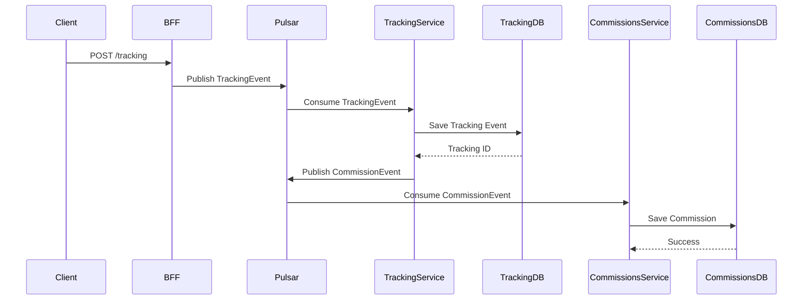
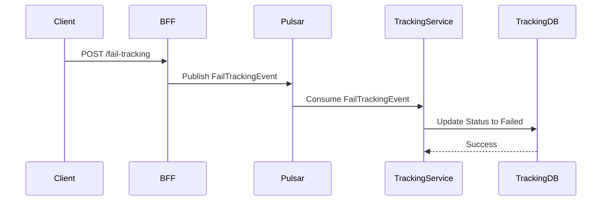

# BFF Service

A REST API service that accepts partner registration requests and publishes events to Apache Pulsar, following hexagonal architecture and CQRS principles.

## Architecture

- **Hexagonal Architecture**: Domain logic isolated from external concerns.
- **CQRS**: Command-side implementation for publishing partner events.

## Setup

1. Install dependencies:
   ```bash
   poetry install --no-root
   ```

2. Copy `.env.example` to `.env` and configure Pulsar settings.

3. Ensure Apache Pulsar is running.

## Running the Service

```bash
python main.py
```

The API will be available at `http://localhost:8000`.

## API

### POST /partners

Publish a partner registration event.

**Request Body:**
```json
{
  "partner_id": "partner_fashion_blogger_001",
  "partner_type": "CONTENT_CREATOR",
  "acceptance_terms": {
    "commission_type": "CPA",
    "commission_rate": 15.0,
    "cookie_duration_days": 45,
    "promotional_methods": ["blog", "social_media", "video"]
  },
  "estimated_monthly_reach": 75000
}
```

**Response:**
```json
{
  "message": "Partner event published successfully",
  "partner_id": "partner_fashion_blogger_001"
}
```

### POST /campaigns

Publish a campaign creation event.

**Request Body:**
```json
{
  "campaign_id": "campaign_summer_2025",
  "name": "Summer Campaign 2025"
}
```

**Response:**
```json
{
  "message": "Campaign event published successfully",
  "campaign_id": "campaign_summer_2025"
}
```

### POST /campaigns/{campaign_id}/partners/{partner_id}

Publish a campaign-partner association event.

**Response:**
```json
{
  "message": "Campaign-partner association event published successfully",
  "campaign_id": "campaign_summer_2025",
  "partner_id": "partner_fashion_blogger_001"
}
```

### POST /campaigns/{campaign_id}/content

Publish a content submission event.

**Request Body:**
```json
{
  "content_url": "https://example.com/content"
}
```

**Response:**
```json
{
  "message": "Content association event published successfully",
  "campaign_id": "campaign_summer_2025",
  "content_id": "uuid-generated",
  "content_url": "https://example.com/content"
}
```

### POST /tracking

Publish a tracking event, which triggers commission calculation.

**Request Body:**
```json
{
  "campaign_id": "campaign_summer_2025",
  "event_type": "click"
}
```

**Response:**
```json
{
  "message": "Tracking event published successfully",
  "campaign_id": "campaign_summer_2025",
  "event_type": "click"
}
```

### POST /fail-tracking

Publish a fail tracking event to revert a tracking event.

**Request Body:**
```json
{
  "tracking_id": 123
}
```

**Response:**
```json
{
  "message": "Fail tracking event published successfully",
  "tracking_id": 123
}
```

## API Sequences

### Partner Creation



### Campaign Creation



### Associate Partner to Campaign



### Submit Content to Campaign



### Register Tracking Event with Commission



### Fail Tracking Event (Revert)



**Note:** If commission processing fails (e.g., no partner associated with campaign), the Commissions Service publishes a FailTrackingEvent to revert the tracking status.